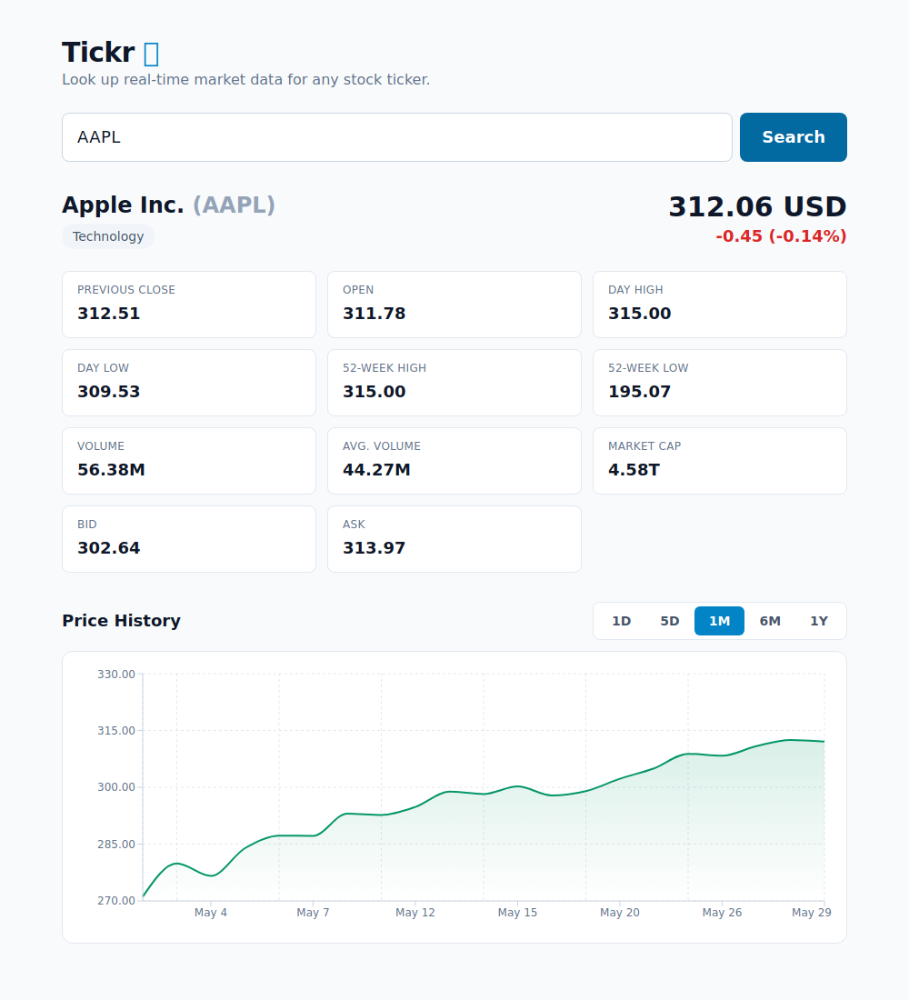

# Tickr 📈

A stock tracking web app: enter a ticker symbol and instantly see live market
data plus an interactive price chart. Market data comes from Yahoo Finance via
[`yfinance`](https://github.com/ranaroussi/yfinance).



## Features

- Look up any stock by ticker symbol
- Current price with daily change in **$ and %** (color-coded up/down)
- Full snapshot: previous close, open, day high/low, 52-week high/low,
  volume, average volume, market cap, and bid/ask
- Company sector
- Interactive price chart across **1D / 5D / 1M / 6M / 1Y** timeframes
- Unknown tickers show a clear inline error below the input (no page reload)

## Tech stack

| Layer | Technology |
|-------|-----------|
| Frontend | React + TypeScript, Vite, Tailwind CSS, Recharts |
| Backend | Python, FastAPI, yfinance, curl_cffi |
| Data | Yahoo Finance (via `yfinance`) |

## Architecture

```
Browser (React SPA, :5173) ──HTTP──> FastAPI (:8000) ──> yfinance ──> Yahoo Finance
                                       /api/quote/{ticker}
                                       /api/history/{ticker}?range=…
```

The frontend is a single page with no router. On search it calls both API
endpoints; an unknown ticker returns HTTP 404, which the UI renders as an
inline error directly below the input.

## Getting started

You'll need **Python 3.10+** and **Node 18+**. Use two terminals.

### 1. Backend

```bash
cd backend
python3 -m venv .venv
.venv/bin/pip install -r requirements.txt
.venv/bin/uvicorn app.main:app --reload --port 8000
```

API runs at `http://localhost:8000` — interactive docs at `/docs`.

### 2. Frontend

```bash
cd frontend
npm install
npm run dev
```

Open **http://localhost:5173**. The frontend reads the API base URL from
`VITE_API_BASE` (defaults to `http://localhost:8000`).

## API

| Method | Path | Description |
|--------|------|-------------|
| `GET` | `/health` | Liveness check |
| `GET` | `/api/quote/{ticker}` | Current market snapshot |
| `GET` | `/api/history/{ticker}?range=1d\|5d\|1mo\|6mo\|1y` | Closing-price series for the chart |

Unknown ticker → **404** `{"detail": "Ticker 'XYZ' does not exist"}`.
Upstream/network failure → **502**.

```bash
curl localhost:8000/api/quote/AAPL
curl "localhost:8000/api/history/AAPL?range=1mo"
curl -i localhost:8000/api/quote/NOTAREAL   # -> 404
```

## Project structure

```
Tickr/
├── backend/
│   ├── app/
│   │   ├── main.py      # FastAPI app + CORS
│   │   ├── routes.py    # /api/quote, /api/history
│   │   ├── services.py  # yfinance access + field mapping
│   │   └── schemas.py   # Pydantic response models
│   └── requirements.txt
└── frontend/
    └── src/
        ├── App.tsx              # layout + state
        ├── api.ts               # typed fetch helpers
        ├── types.ts, format.ts  # types + number formatting
        └── components/          # TickerInput, QuoteStats, TimeframeTabs,
                                  # PriceChart, ErrorBanner
```

## Verification

End-to-end checks live in `frontend/` and use Playwright. With both servers
running:

```bash
cd frontend
node verify.mjs   # headless browser: valid ticker, timeframe switch, bad ticker
node shot.mjs     # regenerates verify-screenshot.png
```

`verify.mjs` asserts that a valid ticker renders the stats grid and chart, that
switching timeframes re-renders the chart, and that a bad ticker shows the
inline error while clearing the previous chart.

## Notes

- **Rate limiting:** Yahoo aggressively rate-limits plain HTTP clients, so
  `backend/app/services.py` routes requests through a `curl_cffi` session that
  impersonates Chrome to avoid `429 Too Many Requests`.
- yfinance occasionally omits fields; those return `null` and the UI shows a
  dash (`—`).
- No database, auth, or caching in this version — a short-TTL cache in front of
  yfinance is the natural next step.
